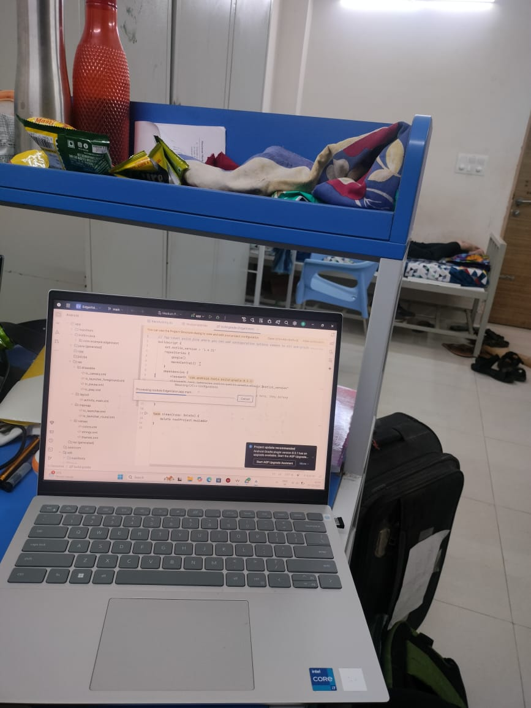
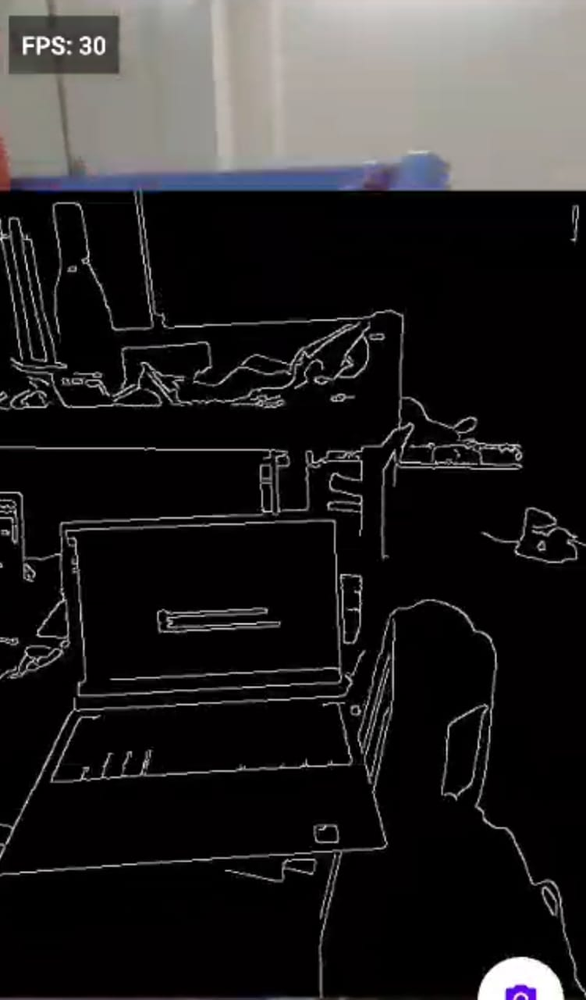
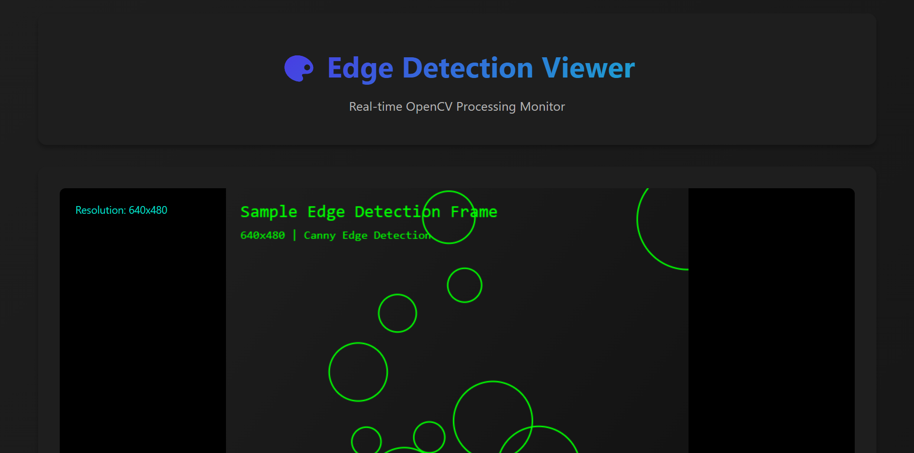
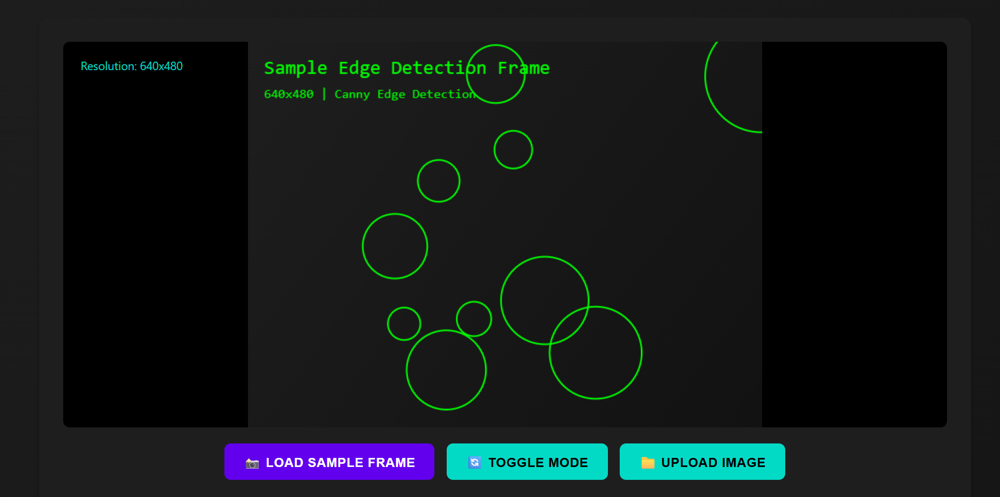
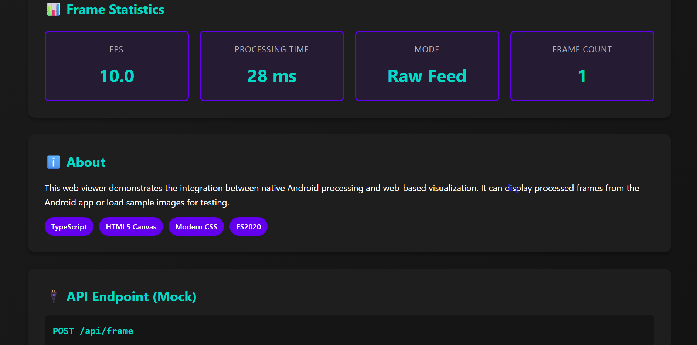

#  Edge Detection Viewer - Android + OpenCV + OpenGL + TypeScript

[](https://developer.android.com/)
[](https://opencv.org/)
[](https://www.opengl.org/)
[](https://www.typescriptlang.org/)

A comprehensive real-time edge detection application demonstrating the integration of Android, OpenCV (C++), OpenGL ES, and a TypeScript-based web viewer. This project processes camera frames in real-time, applies Canny edge detection using native code, and renders the output with hardware acceleration.

##  Features

### Android Application
-  **Real-time Camera Feed**: Utilizes `CameraX` for an efficient and modern camera API.
-  **Native C++ Processing**: High-performance frame processing with OpenCV via JNI.
-  **Edge Detection**: Implements Canny edge detection in native C++.
-  **OpenGL ES Rendering**: Smooth, hardware-accelerated rendering of camera frames.
-  **Dual-Mode View**: Toggle between the raw camera feed and the edge-detected output.
-  **Performance Metrics**: Displays a real-time FPS counter and processing time for performance monitoring.
-  **Material Design UI**: A clean and modern user interface.

### Web Viewer
-  **TypeScript-Based**: A robust web interface for viewing and analyzing frames.
-  **HTML5 Canvas Rendering**: Displays processed frames in the browser.
-  **Statistics Dashboard**: Shows frame resolution, FPS, and processing time.
-  **Mock API**: Simulates a backend endpoint for receiving frame data from the Android app.
-  **Responsive Design**: A modern and responsive UI for different screen sizes.

##  Architecture

The application is designed with a modular architecture that separates concerns between the UI, native processing, and rendering layers.

### Data Flow
The data flows from the camera to the screen through the following steps:
1.  **Camera Capture**: `CameraX` captures frames in `YUV_420_888` format.
2.  **JNI Bridge**: The YUV data is passed to the native C++ layer.
3.  **OpenCV Processing**:
    *   The YUV frame is converted to an RGB `cv::Mat`.
    *   Canny edge detection is applied to the RGB image.
    *   The processed image is converted to RGBA for OpenGL.
4.  **OpenGL Rendering**: The final RGBA data is uploaded as a texture and rendered on a `GLSurfaceView`.

```
┌───────────────────┐   ┌───────────────────┐   ┌─────────────────────┐   ┌───────────────────┐
│   CameraX Input   │──▶│    JNI Bridge     │──▶│  OpenCV Processing  │──▶│  OpenGL Renderer  │
│  (YUV_420_888)    │   │ (Kotlin → C++)    │   │ (Canny Edge Detect) │   │   (GLSurfaceView) │
└───────────────────┘   └───────────────────┘   └─────────────────────┘   └───────────────────┘
```

##  Screenshots and Video Link.

### Android App
| Raw View | Edge-Detected View |
| :------: | :----------------: |
| ||

## Video Link
Click to have a walk through of the app-[[Drive Link]](https://drive.google.com/file/d/1JZ0L1cgh8ABUESPXGiccnFZMznuyIe-9/view?usp=sharing)

### Web Viewer
| Dashboard |
| :-------: |
||||

## Technology Stack

| Component | Technology |
| :--- | :--- |
| **Android** | Kotlin, CameraX, Material Design |
| **Native** | C++17, JNI, CMake |
| **Processing**| OpenCV 4.8.0 |
| **Graphics** | OpenGL ES 2.0, GLSL |
| **Web** | TypeScript, HTML5 Canvas, CSS |

## Setup Instructions

### Prerequisites
- **Android Studio**: Version 2023.1 (Hedgehog) or newer.
- **NDK and CMake**: Install via Android Studio's SDK Manager.
  - NDK version 25.x or higher.
  - CMake version 3.22.1 or higher.
- **Node.js**: v16 or later for the web viewer.

### Step 1: Download OpenCV
The OpenCV SDK is not included in this repository due to its size.
1.  Go to the [OpenCV releases page](https://opencv.org/releases/).
2.  Download the **OpenCV Android SDK**, version 4.8.0 or newer.
3.  Extract the downloaded `.zip` file.

### Step 2: Clone the Repository
```bash
git clone <repo link>
cd <repo location>
```

### Step 3: Add OpenCV to the Project
1.  Locate the `sdk` folder inside the extracted OpenCV directory.
2.  Copy the `sdk` folder into the `app/src/main/jni/opencv/` directory of the project.

After copying, the directory structure should look like this:
```
app/src/main/jni/
└── opencv/
    └── sdk/
        ├── etc/
        ├── java/
        └── native/
```

### Step 4: Build and Run the Android App
1.  Open the project in Android Studio.
2.  Allow Gradle to sync.
3.  Connect an Android device or start an emulator.
4.  Click the **Run** button.

### Step 5: Build and Run the Web Viewer
1.  Navigate to the `web` directory:
    ```bash
    cd web
    ```
2.  Install the dependencies:
    ```bash
    npm install
    ```
3.  Start the development server:
    ```bash
    npm start
    ```
4.  Open your browser to `http://localhost:1234`.

## 📁 Project Structure
```
.
├── app/                  # Android application source
│   ├── src/main/
│   │   ├── java/         # Kotlin source files
│   │   │   └── .../
│   │   │       ├── MainActivity.kt
│   │   │       ├── NativeProcessor.kt
│   │   │       └── gl/GLRenderer.kt
│   │   ├── jni/          # Native C++ source files
│   │   │   ├── src/
│   │   │   │   ├── jni_bridge.cpp
│   │   │   │   └── native_processor.cpp
│   │   │   ├── include/
│   │   │   └── CMakeLists.txt
│   │   └── AndroidManifest.xml
│   └── build.gradle
├── web/                  # Web viewer source
│   ├── src/
│   │   ├── index.ts
│   │   └── ...
│   ├── index.html
│   └── package.json
└── build.gradle          # Root Gradle file
```
